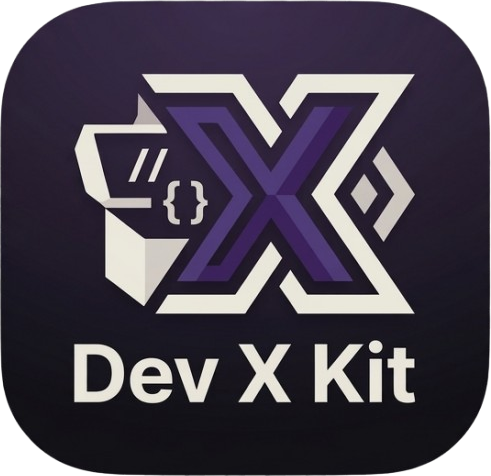

<p align="center">
  
</p>

# Dev X Kit 🛠️

**Dev X Kit** is a toolbox for developers. Built for speed, precision, and privacy, it provides a massive collection of conversion, formatting, and generation tools all in one place. No sign-ups, no limits, and no tracking.

**Try it out [here](https://dev-x-kit.vercel.app/)**

## 🚀 Key Features

- **100% Free & Unlimited:** No paywalls, no "pro" tiers, and no daily usage limits.
- **Privacy-First:** Your data never leaves your machine. Inputs, settings, and tool preferences are never saved to a server database.
- **Local Persistence:** All persistent data is stored locally in your browser, and only if you choose to enable it.
- **Live Output:** Experience real-time feedback. As you modify inputs or toggle settings, the output updates instantly.
- **Pro Editor Experience:** Conversion tools feature side-by-side **Monaco Editors** (the engine behind VS Code) for high-performance editing and syntax highlighting.

## 🧰 The Toolkit

Dev X Kit offers dozens of specialized utilities across several categories:

### 🔄 Data & Code Converters

Transform data formats instantly with dual-pane live syncing.

- **JSON Transformations:** Convert JSON to TypeScript, Rust, Go, Python, MySQL, Zod, Mongoose, and more.
- **Styling & CSS:** Convert between CSS, SCSS, JSS, and Tailwind-ready JSX.
- **Serialization:** Handle PHP Serialized data, TOML, YAML, and GraphQL conversions.
- **Markup:** Move between HTML, Markdown, and SVG Optimized formats.

### 🎨 Design & Visual Tools

- **Color Suite:** Advanced Color Picker, Contrast Checker, and a Color Gradient Editor.
- **CSS Generators:** CSS Triangle Generator and a Smooth Shadow Editor for realistic UI layering.
- **SVG Utilities:** SVG to Data URI, SVG to React components, and SVG optimization.

### 📝 Content & Utility

- **Generators:** UUID, Lorem Ipsum, and QR Codes.
- **Editors:** Full-featured Markdown and JSON editors.
- **Analyzers:** URL Parser, Word Counter, and CSS Unit Converters.
- **Encoding:** Base64 File/Image Encoder and Decoder.

## 🛠️ Tech Stack

- **Framework:** [Next.js v16](https://nextjs.org/)
- **UI Components:** [Shadcn UI](https://ui.shadcn.com/)
- **Code Editor:** [Monaco Editor](https://microsoft.github.io/monaco-editor/)
- **Styling:** Tailwind CSS

## 📥 Getting Started

To run the project locally:

1. Clone the repository

   ```bash
   git clone https://github.com/xristosn/dev-x-kit
   ```

2. Install Dependencies

   ```bash
   npm install
   # or
   yarn install
   ```

3. Start Development Server

   ```bash
   yarn dev
   # or
   npm run dev
   ```

4. Build for Production

   ```bash
   yarn build
   # or
   npm run build
   ```

## 🔒 Privacy & Security

Developer tools shouldn't be data traps.

- Zero Server-Side Storage: We do not have a backend database for user inputs.
- Client-Side Execution: Logic is executed directly in your browser.
- No Sign-up: We don't need your email or your data. Just use the tools.

## 📄 License

[MIT](https://github.com/xristosn/dev-x-kit/blob/main/LICENSE)

### Name, Logos, and Assets (All Rights Reserved)

The MIT License applies **only** to the underlying source code. It does **not** grant permission to use:

- The name **"Dev X Kit"** or any confusingly similar names.
- Logos, branding, icons, audio, or custom design graphics located in the project files.
